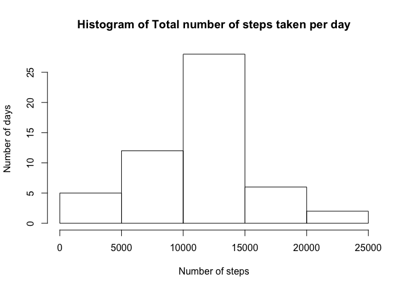
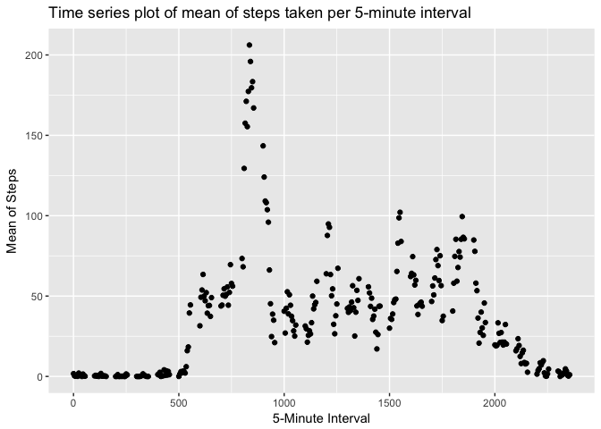
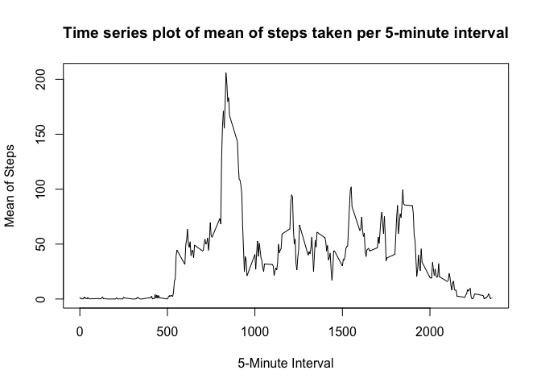
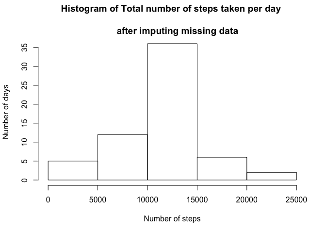
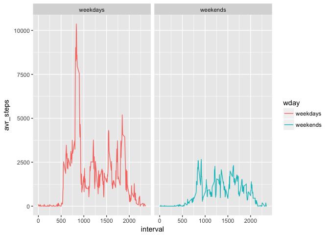

# Reproducible Research: Peer Assignment 1
Jong-dae Kim  
2017 6 12   
This is the R Markdown for the Preer Assignment 1 of "Reproducible Research".
I am Jong-dae Kim in South Korea.

Glad to meet you and Thank you for your reviewing.

Let get start.


## Loading packages

```r
library(dplyr)
library(ggplot2)
```


## Loading the data

```r
activity <- read.csv("activity.csv")
```


## What is mean total number of steps taken per day?

```r
activity_date <- group_by(activity, date) %>%
     summarize(total_steps = sum(steps))
hist(as.numeric(activity_date$total_steps ),
    xlab = "Number of steps",
    ylab = "Number of days",
    main = "Histogram of Total number of steps taken per day")
```

<!-- -->

```r
summary(activity_date$total_steps)
```

```
##    Min. 1st Qu.  Median    Mean 3rd Qu.    Max.    NA's 
##      41    8841   10765   10766   13294   21194       8
```


## What is the average daily activity pattern?
1. Time series plot

```r
activity_interval <- group_by(activity, interval) %>% summarize(mean_steps = mean(steps, na.rm=TRUE))
ggplot(activity_interval, aes(x=interval, y=mean_steps)) + geom_point() +
    labs(x = "5-Minute Interval", y = "Mean of Steps", 
        title = "Time series plot of mean of steps taken per 5-minute interval")
```

<!-- -->

```r
with(activity_interval, plot(interval, mean_steps, type = "l", 
    xlab = "5-Minute Interval",ylab = "Mean of Steps",
    main = "Time series plot of mean of steps taken per 5-minute interval") )
```

<!-- -->


2. 5-minute interval, contains the maximum numbers of steps

```r
max_interval <- which.max(activity_interval$mean_steps)
activity_interval[max_interval,]
```

```
## # A tibble: 1 x 2
##   interval mean_steps
##      <int>      <dbl>
## 1      835   206.1698
```


## Imputing missing values

1. Calculate and report the total number of missing values in the dataset 

```r
sum(is.na(activity$date))
```

```
## [1] 0
```

```r
sum(is.na(activity$interval))
```

```
## [1] 0
```

```r
sum(is.na(activity$steps))
```

```
## [1] 2304
```

2. Create a new dataset with the missing data filled in(the mean for that 5-minute interval)

```r
new <- activity
for (i in 1:17568){
    if (is.na(new[i,1]) == TRUE) {
        new[i,1] <- activity_interval[activity_interval$interval==new[i,3], 2]
    }
}
   
sum(is.na(new$steps))
```

```
## [1] 0
```

3. Make a histogram of the total number of steps taken each day 


```r
new_date <- group_by(new, date) %>%
    summarize(total_steps = sum(steps))
hist(new_date$total_steps,     
    xlab = "Number of steps",
    ylab = "Number of days",
    main = "Histogram of Total number of steps taken per day \n 
    after imputing missing data")
```

<!-- -->


4. Report the mean and median total number of steps taken per day. 

```r
summary(new_date$total_steps)
```

```
##    Min. 1st Qu.  Median    Mean 3rd Qu.    Max. 
##      41    9819   10766   10766   12811   21194
```

There is a little difference between the former estimates and the latter estimates
There is a little impact of imputing missing data on the estimates of the total daily number of steps.

## Are there differences in activity patterns between weekdays and weekends?


```r
wday <- unclass(strptime(new$date, "%Y-%m-%d"))$wday
new <- cbind(new, wday)
new[new$wday == 0 | new$wday == 6, 4] <- "weekends"
new[!(new$wday == "weekends"), 4] <- "weekdays"
new_interval <- group_by(new, interval, wday) %>% summarise(avr_steps = sum(steps))
ggplot(new_interval, aes(interval, avr_steps, color = wday)) + geom_line() +
    facet_grid(.~wday)
```

<!-- -->


There was more steps on weekends than on weekdays, especially in the morning.


